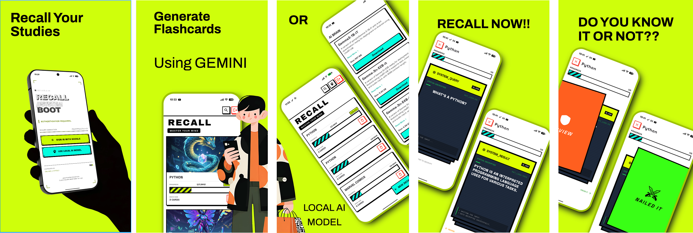

# Recall 🧠

Recall is a personal project designed to explore the integration of **AI (On-Device + Cloud)** into mobile apps while pushing the boundaries of UI design with a **Neo-Brutalist** aesthetic. It aims to make learning engaging through gamification and automated flashcard generation.

## 🚀 Features

-   **Dual AI Power**:
    -   **On-Device**: Uses `flutter_gemma` for local, privacy-focused generation.
    -   **Cloud**: Integrates with **Google Gemini** via Firebase for extensive knowledge retrieval and image generation.
-   **Fully Responsive**: Built with `responsive_framework` and a custom `responsive_scaler` to ensure a perfect look on any device size.
-   **Gamified Experience**: High-contrast, bold Neo-Brutalist design.
-   **Smart Notifications**: Daily reminders to review your flashcards.
-   **Secure**: Firebase Authentication and Firestore backend.

---

## 🎨 Illustration


## 📸 Screenshots


---

## 🛠 Tech Stack

-   **Framework**: Flutter
-   **State Management**: BLoC
-   **AI**: `flutter_gemma` (Local), Google Gemini (Cloud)
-   **Backend**: Firebase (Auth, Firestore)
-   **UI**: `responsive_framework` + `responsive_scaler`, Custom Neo-Brutalist widgets

---

## ⚙️ Configuration & Setup

This project uses both local and cloud AI services, which requires specific configuration files.

### 1. Local AI Setup (Hugging Face)

To use the on-device generation capabilities (Gemma), you need a Hugging Face token.

1.  Create a file named `config.json` in the root of your project.
2.  Add your Hugging Face token:
    ```json
    {
      "HUGGINGFACE_TOKEN": "YOUR_HUGGING_FACE_TOKEN"
    }
    ```
    *Note: For implementation details, this project refers to the [Google AI Edge Gallery](https://github.com/google-ai-edge/gallery).*

### 2. Firebase Setup (Cloud AI & Auth)

1.  **Create a Firebase Project**: Go to the Firebase Console and create a new project.
2.  **Add Apps**: Add Android and iOS apps to your project. Download `google-services.json` (for Android) and `GoogleService-Info.plist` (for iOS) and place them in their respective folders.
3.  **Enable Authentication**: Enable Email/Password or your preferred sign-in method.
4.  **Enable Firestore**: Create a Firestore database.
5.  **Set Security Rules**: Update your Firestore rules to the following to ensure user data privacy:
    ```
    rules_version = '2';
    service cloud.firestore {
      match /databases/{database}/documents {
        // Match any document inside the 'users' collection
        match /users/{userId}/{document=**} {
          // Allow access ONLY if the user is logged in
          // AND their Auth ID matches the Document ID
          allow read, write: if request.auth != null && request.auth.uid == userId;
        }
      }
    }
    ```
6.  **Enable Blaze Plan (For Image Generation)**:
    *   **Important**: For image generation features, your Firebase project must be on the **Blaze (Pay as you go)** plan.

---

## 🏃‍♂️ How to Run

Since the project uses `config.json` for sensitive keys, you must include it in your build commands.

**Debug Mode:**
```bash
flutter run --debug --dart-define-from-file=config.json
```

**Release Mode:**
```bash
flutter run --release --dart-define-from-file=config.json
```

**Build APK:**
```bash
flutter build apk --release --dart-define-from-file=config.json
```

---
